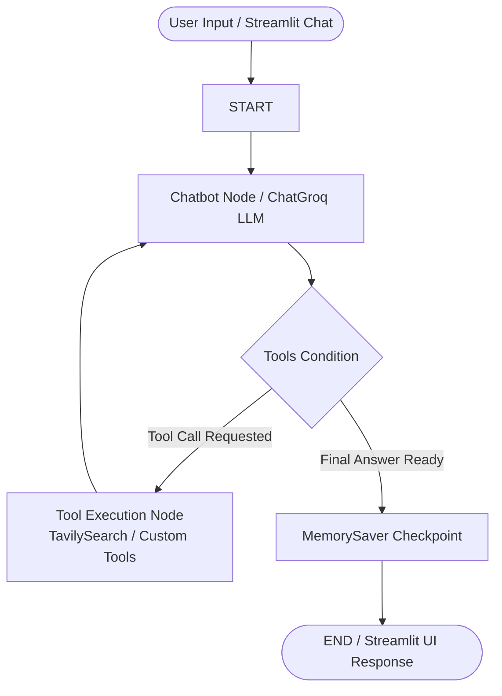

<div align="center">

<br />

## 📌 Overview

**Agentic AI Chatbot** is a production-ready, autonomous agent built using **LangGraph** graph orchestration, **Streamlit**, and **ChatGroq** LLMs. Unlike static prompt-response bots, this agent uses a ReAct (Reasoning + Acting) loop to dynamically select tools, execute real-time web searches, perform calculations, and maintain context-aware conversation history across multiple turns.

> [!NOTE]
> Designed as both an educational reference and a modular blueprint for building agentic AI applications with persistent memory, tool calling, and web interfaces.

---

## ✨ Key Features

- 🧠 **ReAct Agentic Workflow**: Dynamic decision-making loop powered by LangGraph `StateGraph` and conditional tool edges.
- 🎨 **Interactive Streamlit Web UI**: Elegant, dark-themed web app ([app.py](file:///c:/Users/haris/Desktop/Agentic-AI-Based-Chatbot-Development/app.py)) with model selection, session memory management, and live tool feedback.
- 🌐 **Real-Time Web Search**: Integrated with `TavilySearch` for fetching live news, current events, and up-to-date domain data.
- 🧮 **Custom Tool Extensibility**: Modular Python `@tool` decorator pattern allowing seamless addition of custom capabilities (e.g. math functions).
- 💾 **Stateful Memory Checkpointing**: Conversation persistence across sessions using LangGraph's `MemorySaver`.
- ⚡ **High-Speed Execution**: Leverages Groq LPU acceleration running `openai/gpt-oss-120b` for ultra-low latency responses.
- 📦 **Multi-Interface Support**: Ready-to-use Streamlit Web App ([app.py](file:///c:/Users/haris/Desktop/Agentic-AI-Based-Chatbot-Development/app.py)), CLI runner ([main.py](file:///c:/Users/haris/Desktop/Agentic-AI-Based-Chatbot-Development/main.py)), and modular importable graph function (`build_chatbot_graph()`).

---

## 🏗️ System Architecture

The chatbot operates as a directed cyclic graph with automatic tool condition evaluation:



---

## 💻 Environment & Setup Guide

### Prerequisites

- **Python**: `^3.13`
- **Package Manager**: [`uv`](https://github.com/astral-sh/uv) (Recommended) or standard `pip`
- **API Keys**:
  - [Groq API Key](https://console.groq.com/) (Required for LLM inference)
  - [Tavily API Key](https://tavily.com/) (Required for web search tool)

---

### Step-by-Step Installation

#### Option A: Using `uv` (Fastest & Recommended)

```bash
# 1. Clone the repository
git clone https://github.com/HarishThupati63/Agentic-AI-Based-Chatbot-Development.git
cd Agentic-AI-Based-Chatbot-Development

# 2. Create virtual environment and install dependencies automatically
uv sync
```

#### Option B: Using Standard Python `venv` & `pip`

```bash
# 1. Clone the repository
git clone https://github.com/HarishThupati63/Agentic-AI-Based-Chatbot-Development.git
cd Agentic-AI-Based-Chatbot-Development

# 2. Create a virtual environment
python -m venv .venv

# 3. Activate the virtual environment
# On Windows (PowerShell):
.\.venv\Scripts\Activate.ps1


# On Windows (Command Prompt / CMD):
.venv\Scripts\activate.bat


# 4. Install dependencies
pip install -r requirements.txt
```

---

### 🔑 Environment Variables Configuration

1. Copy the `.env.example` template to `.env`:

   ```bash
   cp .env.example .env
   ```
2. Open `.env` and fill in your credentials:

   ```env
   # LLM Provider Key (Required)
   GROQ_API_KEY=gsk_your_groq_api_key_here

   # Web Search Tool Key (Required)
   TAVILY_API_KEY=tvly-your_tavily_api_key_here

   # Optional: LangSmith Observability & Tracing
   LANGCHAIN_TRACING_V2=true
   LANGCHAIN_API_KEY=lsv2_pt_your_langsmith_key_here
   LANGCHAIN_PROJECT=Agentic-AI-Chatbot
   ```

---

## 🚀 Quick Start

### 🌐 Run Streamlit Web Application

```bash
streamlit run app.py
```

### 💻 Run Interactive CLI

```bash
python main.py
```

---

## 💡 Python Programmatic Usage

You can easily import and embed the chatbot graph into your own applications (Streamlit, FastAPI, or custom services):

```python
from basic_chatbot import build_chatbot_graph

# Initialize compiled LangGraph app
chatbot_app = build_chatbot_graph(model_name="openai/gpt-oss-120b")

# Execute with thread ID for memory persistence
config = {"configurable": {"thread_id": "session_001"}}

response = chatbot_app.invoke(
    {"messages": [("user", "Hello! Can you search for recent AI benchmarks?")]},
    config=config
)

print(response["messages"][-1].content)
```

---

## 📁 Project Structure

```text
Agentic-AI-Based-Chatbot-Development/
├── notebooks/
│   └── 1-basicchatbot.ipynb    # Experimental notebook & step-by-step prototyping
├── app.py                      # Interactive Streamlit Web Interface
├── basic_chatbot.py            # Core LangGraph agent, tool definitions & CLI
├── main.py                     # Project CLI entry point
├── pyproject.toml              # Project configuration and dependency lock (uv)
├── requirements.txt            # Pip dependency specification
├── .env.example                # Template for environment variables
├── .gitignore                  # Git exclude patterns
├── LICENSE                     # MIT License terms
└── README.md                   # Project documentation
```

---

## 🛡️ Observability & Monitoring

This project comes pre-configured for **LangSmith** tracing. When `LANGCHAIN_TRACING_V2=true` is set in your `.env`, every graph execution, LLM call, and tool invocation is logged to your LangSmith dashboard for real-time monitoring and debugging.

---

## 📜 License

Distributed under the MIT License. See [`LICENSE`](LICENSE) for more information.
