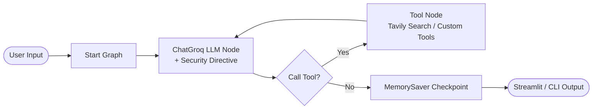

# 🤖 Agentic AI Chatbot

> A security-hardened, production-ready autonomous conversational AI agent built with **LangGraph**, **LangChain**, **Streamlit**, and **ChatGroq**.

[](https://www.python.org/)
[](https://github.com/langchain-ai/langgraph)
[](https://python.langchain.com/)
[](https://groq.com/)
[](https://tavily.com/)
[](https://streamlit.io/)
[](https://smith.langchain.com/)
[](https://github.com/astral-sh/uv)

---

## 🛠️ Complete Tech Stack

| Category | Technology | Version | Purpose in Application |
| :--- | :--- | :--- | :--- |
| **Language** | [Python](https://www.python.org/) | `^3.13` | Core programming language runtime |
| **Graph Orchestration** | [LangGraph](https://github.com/langchain-ai/langgraph) | `>=1.0.4` | Cyclic state graph engine, ReAct decision loops & `MemorySaver` checkpointer |
| **Agent Framework** | [LangChain Core](https://python.langchain.com/) | `>=1.1.3` | Standardized `@tool` decorators, message schemas & prompt management |
| **LLM Provider** | [ChatGroq](https://console.groq.com/) | `>=1.1.0` | Ultra-fast LPU inference (`openai/gpt-oss-120b`, `llama-3.3-70b-versatile`) |
| **Web Search Tool** | [Tavily AI Search](https://tavily.com/) | `>=0.2.14` | Real-time web index queries, current news retrieval & content extraction |
| **User Interface** | [Streamlit](https://streamlit.io/) | `>=1.40.0` | Dark-themed interactive web app, isolated session UI & connection status badges |
| **Observability** | [LangSmith](https://smith.langchain.com/) | `>=0.4.59` | End-to-end tracing, LLM cost monitoring, latency analytics & run debugging |
| **Package Manager** | [uv](https://github.com/astral-sh/uv) | Latest | Lightning-fast Python package installation and workspace dependency management |
| **Config & Secrets** | [python-dotenv](https://github.com/theskumar/python-dotenv) | `>=1.2.1` | Local environment variables management (`.env`) |
| **Prototyping** | [Jupyter Notebook](https://jupyter.org/) | — | Interactive experimentation and step-by-step graph prototyping (`1-basicchatbot.ipynb`) |

---

## 📌 Overview

**Agentic AI Chatbot** is a stateful conversational agent implementing the **ReAct (Reasoning + Acting)** framework. Powered by Groq LPU acceleration and orchestrated via LangGraph directed graphs, the chatbot dynamically decides when to query real-time search tools, perform calculations, or respond directly while preserving context across multi-turn sessions.

---

## ✨ Key Features

- 🧠 **ReAct Agentic Workflow**: Dynamic decision cycle using LangGraph `StateGraph` and conditional tool edges.
- 🛡️ **Security Hardened**: System prompt guardrails against indirect prompt injection and malicious tool outputs.
- 🎨 **Streamlit Web Dashboard**: Interactive UI ([app.py](app.py)) with model selection, session controls, and connection diagnostics.
- 🌐 **Real-Time Web Search**: Integrated with `TavilySearch` for live web access, news indexing, and domain queries.
- 🔒 **Cryptographic Session Isolation**: Isolated memory sessions managed with UUIDv4 thread identifiers.
- ⚡ **Groq LPU Acceleration**: High-speed LLM inference supporting `openai/gpt-oss-120b`, `llama-3.3-70b-versatile`, and `mixtral-8x7b-32768`.
- 🧮 **Modular Tool Registry**: Extensible `@tool` architecture for seamless integration of custom Python capabilities.

---

## 🏗️ Architecture

The chatbot relies on a directed cyclic graph with automated tool condition evaluation:



---

## 🛡️ Security Hardening

- **Prompt Injection Defense**: Tool outputs are strictly scoped as untrusted 3rd-party reference data.
- **Recursion Guardrail**: Hard `recursion_limit = 6` prevents infinite tool loops and budget drain.
- **Traceback Sanitization**: Raw system errors are logged server-side; safe user notices are displayed in UI.
- **Secrets Management**: Prioritizes `st.secrets` with fallback to `.env` variables.

---

## ⚙️ Quick Start

### 1. Prerequisites
- Python `3.13+`
- [Groq API Key](https://console.groq.com/) *(Required)*
- [Tavily API Key](https://tavily.com/) *(Required for search)*

### 2. Installation

#### Using `uv` (Recommended)
```bash
git clone https://github.com/HarishThupati63/Agentic-AI-Based-Chatbot-Development.git
cd Agentic-AI-Based-Chatbot-Development
uv sync
```

#### Using Standard `pip` & `venv`
```bash
python -m venv .venv

# Windows (PowerShell)
.\.venv\Scripts\Activate.ps1

# Linux / macOS
source .venv/bin/activate

pip install -r requirements.txt
```

### 3. Environment Setup

Create `.env` file from `.env.example`:
```bash
cp .env.example .env
```

Configure keys in `.env`:
```env
GROQ_API_KEY=your_groq_api_key_here
TAVILY_API_KEY=your_tavily_api_key_here

# Optional: LangSmith Observability
LANGCHAIN_TRACING_V2=true
LANGCHAIN_API_KEY=your_langsmith_api_key_here
LANGCHAIN_PROJECT=Agentic-AI-Chatbot
```

---

## 🚀 Running the Chatbot

### Web Application (Streamlit)
```bash
streamlit run app.py
```

### Terminal CLI Mode
```bash
python main.py
```

---

## 💻 Programmatic Usage

```python
from basic_chatbot import build_chatbot_graph

# Compile graph with desired model
app = build_chatbot_graph(model_name="openai/gpt-oss-120b")

# Session configuration
config = {
    "configurable": {"thread_id": "user_session_123"},
    "recursion_limit": 6
}

# Execute agent query
result = app.invoke(
    {"messages": [("user", "What are the latest developments in AI safety?")]},
    config=config
)

print(result["messages"][-1].content)
```

---

## 📂 Project Structure

```text
Agentic-AI-Based-Chatbot-Development/
├── app.py                  # Streamlit Web Application & UI controls
├── basic_chatbot.py        # Core LangGraph agent & tool definitions
├── main.py                 # Terminal CLI entry point
├── pyproject.toml          # uv configuration & dependency locking
├── requirements.txt        # Standard pip requirements
├── .env.example            # Environment variables template
├── .gitignore              # Git ignore rules
├── README.md               # Documentation
└── notebooks/
    └── 1-basicchatbot.ipynb# Prototyping & experiment notebook
```

---

## 📈 Observability

Built-in support for **LangSmith** tracing. When `LANGCHAIN_TRACING_V2=true` is set, all execution steps, tool calls, and LLM reasoning steps are traced automatically in your LangSmith dashboard.
